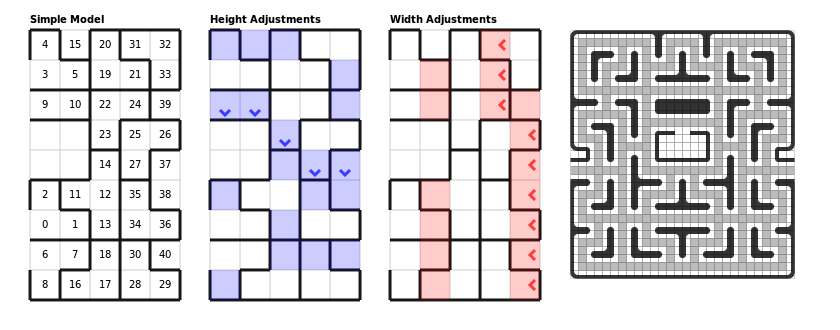

# Pac-Man Maze Generator

Generating random mazes aesthetically similar to those found in Pac-Man and Ms. Pac-Man.
The [tetris](tetris) solution yielded best results:

<a href="http://shaunlebron.github.com/pacman-mazegen">Click here for an explanation.</a>

## History

Research conducted summer 2012.

- The [randomfill](randomfill) folder contains a Python solution that uses a special
  heuristic for progressively placing random valid walls.
- The [answerset](answerset) folder contains a
  [Clingo](http://potassco.sourceforge.net/#clingo) solution that specifies
  declarative constraints.  This [blog post](http://eis-blog.ucsc.edu/2011/10/map-generation-speedrun/)
  is a good introduction to map generation using Clingo.
- The [spanningtree](spanningtree) folder is a lead to apply a modified version of conventional maze generation algorithms.
- The [tetris](tetris) folder contains a solution for stacking pieces in a tetris like manner.
